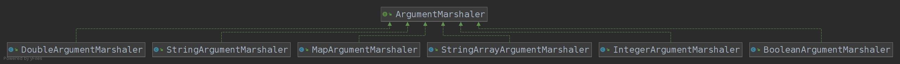

# Java Argument Parser
The Code has been forked from Uncle Bob's Clean code Args.  
@author: Upinder Singh (2019201083)

[Credits: Uncle Bob Clean Code](https://github.com/unclebob/javaargs)

## Exceptions
Added Hierarchy of Exception classes. This enables us to handle and modify each Exception's behaviour separately, if required in future. 
## Marshalers

Each Marshaler tries to parse command line argument according to the given schema, raises exceptions whenever it fails to do so. Currently, it supports parsing six fundamental types:
* Boolean
* Double
* Integer
* Map
* String
* StringArray    

## Usage
### Example 
Schema: *(f,s*,n#,a##,p[*])*  
Coresponding command line: *"-f -s Bob -n 1 -a 3.2 -p e1 -p e2 -p e3*

    - char    - Boolean arg.
    - char*   - String arg.
    - char#   - Integer arg.
    - char##  - double arg.
    - char[*] - one element of a string array.

### Dependencies
	Apache Ant Build Tool >= 1.10  
	JUnit >= 4.13  
	Hamcrest Core >= 1.3.jar

### Clean, Build, Compile and Test
    ant clean
    ant build
    ant compile
    ant test
### Generate Jar
    ant jar

